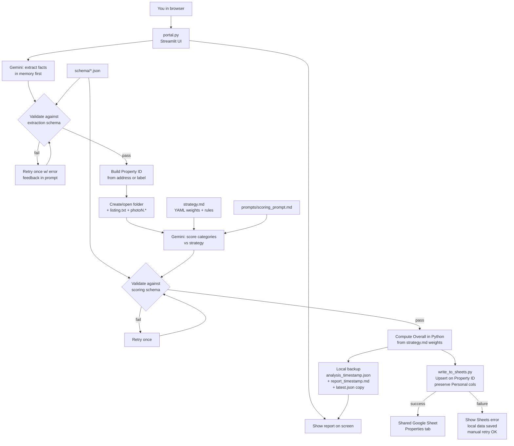

# AI Real Estate Acquisition Assistant — Full Build Plan (Revised v4)

Greenfield project. **Portal-first input**, **Google Sheets as the shared database**, **GitHub for code/version control**, local files as backup/archive. Phase 9 features (auto Zillow scrape, maps, crime APIs, etc.) stay out of scope.

**Changes from v3 (review fixes):** extract-then-slug-then-folder flow; Personal Sheet columns preserved on re-analyze; category score semantics locked (10 = strong match / low concern); Strengths/Weaknesses in Sheet; `pyyaml` for strategy weights; 5-photo cap; `fixtures/` sample listing; Phase 1 deliverable no longer claims portal UI exists; photo naming standardized to `photoN.*`; prefer local Git clone over iCloud for day-to-day work.

**Carried from earlier revisions:** upsert keys on Property ID (folder slug); timestamped local backups; overall score computed in Python from strategy weights; JSON Schema validation with one retry; Sheets write failures surfaced distinctly from analysis failures.

---

## What you will use day-to-day

1. Run `streamlit run portal.py` → browser opens at `http://localhost:8501`
2. Paste a listing URL (optional), paste copied listing text, upload up to 5 screenshots
3. Click **Analyze**
4. See scores + recommendation on screen; row appears in your shared Google Sheet
5. Share the Sheet link with anyone who needs read/edit access

**Target:** under 2 minutes per property (excluding API latency).

### Three systems, three jobs

| System | Role |
|--------|------|
| **Streamlit portal** | Input UI — paste listings, upload photos, run analysis |
| **Google Sheets** | Shared property database — scores, rankings, visit notes (share with anyone) |
| **GitHub** | Code + prompts + strategy — version control, collaboration, safe backups |

**Working directory:** Prefer cloning the GitHub repo to a local non-iCloud path for day-to-day work. iCloud Drive folders can cause sync/git friction; keep the specs folder as reference if needed, but develop from the clone.

---

## Architecture



**Data authority:** Google Sheet is the database you share and rank from. Local files are per-property, per-run archives. A Sheets write failure never loses data — local files are written first and are self-sufficient. If extraction fails validation twice, write nothing (no folder, no Sheet row).

---

## Project structure

```
Real Estate AI/
├── portal.py                    # Streamlit UI (main entry point)
├── strategy.md                  # YAML weights block + investment rules (rarely edited)
├── prompts/
│   ├── extraction_prompt.md     # Facts only, no opinions
│   └── scoring_prompt.md        # Category scores vs strategy (no overall score)
├── schema/
│   ├── extraction_schema.json   # JSON Schema for extraction output
│   └── scoring_schema.json      # JSON Schema for scoring output
├── fixtures/
│   └── sample_listing.txt       # Synthetic listing for smoke tests (no real PII)
├── properties/                  # Auto-created by portal; gitignored
│   └── 211_Brook_Trail_Greenwood_Lake_NY/   # slug == Property ID, immutable once created
│       ├── listing.txt
│       ├── photo1.jpg
│       ├── photo2.png
│       ├── analysis_2026-08-01T15-00-00.json
│       ├── report_2026-08-01T15-00-00.md
│       └── latest.json          # plain copy of most recent run
├── scripts/
│   ├── analyze_property.py      # Core pipeline (portal + CLI)
│   ├── write_to_sheets.py       # Upsert on Property ID; preserve Personal columns
│   ├── scoring.py               # Parse weights; compute weighted overall
│   └── utils.py                 # Env, prompts, slug, schema validation, Gemini client
├── credentials/
│   └── service_account.json     # gitignored
├── .env                         # gitignored
├── .env.example
├── .gitignore
├── requirements.txt
└── README.md                    # Clone, credentials, Gemini spend notes, run portal
```

**GitHub repo:** private, e.g. `real-estate-ai-assistant`. Code, prompts, strategy, fixtures live in Git; secrets and property data stay local.

---

## Phase 1: GitHub, project setup, and Google Sheet (2–3 hours)

### 1.1 Create GitHub repository and scaffold

1. Create a **private** repo on GitHub (e.g. `real-estate-ai-assistant`)
2. Scaffold locally: folders, `requirements.txt`, `.gitignore`, `.env.example`, `README.md`, empty `properties/.gitkeep` (folder ignored except keep file if useful — or omit and rely on runtime creation)
3. Initial commit and push:

```bash
git init
git add .
git commit -m "Initial scaffold: portal stubs, scripts, prompts, strategy"
git branch -M main
git remote add origin git@github.com:<you>/real-estate-ai-assistant.git
git push -u origin main
```

4. Clone to a **local non-iCloud path** for day-to-day development
5. Invite collaborators on GitHub if others will help with code/prompts

### 1.2 What goes in Git vs stays local

| In GitHub (committed) | Never committed (`.gitignore`) |
|-----------------------|--------------------------------|
| `portal.py`, `scripts/` | `.env` (API keys) |
| `prompts/`, `schema/`, `strategy.md` | `credentials/service_account.json` |
| `fixtures/` | `properties/` (listings, photos, analyses) |
| `requirements.txt`, `README.md`, `.env.example`, `BUILD_PLAN.md` | `__pycache__/`, `.DS_Store` |

Property data stays on your machine; the **shared Google Sheet** is how collaborators see analyzed properties. GitHub is for the tool itself.

**Duplicate listings in v1:** Pasting the same listing twice with different labels creates two Property IDs. Accept for v1; document in README. Later enhancement: warn if Link already exists in Sheet.

### 1.3 Dependencies (`requirements.txt`)

- `streamlit` — portal UI
- `google-genai` — Gemini multimodal
- `gspread` + `google-auth` — Sheets API
- `python-dotenv` — env vars
- `pillow` — image validation
- `jsonschema` — validate extraction/scoring output
- `pyyaml` — parse weights YAML block from `strategy.md`

`.gitignore`: `.env`, `credentials/`, `properties/`, `__pycache__/`, `.DS_Store`

`.env.example` with documented keys (no real values).

`README.md`: clone → copy `.env.example` → add credentials → create Sheet → run portal; note Gemini cost (multimodal, capped at 5 images).

### 1.4 Create shared Google Sheet

- One spreadsheet, tab named **Properties**
- Header row with all columns (see Phase 7); **Property ID is column A and is the upsert key**
- Share with service account email as **Editor**
- Share with humans via normal Google sharing (Viewer or Editor)

### 1.5 Connect APIs

| Secret | Where | Purpose |
|--------|-------|---------|
| `GEMINI_API_KEY` | `.env` | Extraction + scoring |
| `GOOGLE_SHEETS_ID` | `.env` | Target spreadsheet |
| `credentials/service_account.json` | file | Sheets write access |
| `GEMINI_MODEL` | `.env` optional | Verify current model name at build time before hardcoding a default |

### 1.6 Phase 1 deliverable

- Private GitHub repo live with scaffold committed
- Credentials documented; a small smoke script or README check confirms env + Sheets auth load without error
- **Portal UI is not required yet** — that lands in Phase 3 / build Step 8

---

## Phase 2: Investment strategy and scoring weights (1–1.5 hours)

Create `strategy.md` with:

1. A **fenced YAML block at the top** for weights (parsed by `scripts/scoring.py` via `pyyaml`)
2. Human-readable investment rules below

At the top of `strategy.md`, include a fenced YAML block like this (then the human-readable rules below it):

- `weights.financial`: 0.20
- `weights.location`: 0.20
- `weights.property`: 0.10
- `weights.appreciation`: 0.10
- `weights.rental`: 0.10
- `weights.management`: 0.10
- `weights.lifestyle`: 0.05
- `weights.climate`: 0.05
- `weights.risk`: 0.10

`scoring.py` must **fail fast** if the weights block is missing, any category is missing, or weights do not sum to `1.0` within a small tolerance (e.g. `abs(sum - 1.0) > 0.001`).

### Category score semantics (locked)

All nine category scores use the same direction:

- **0** = poor match / high concern
- **10** = strong match / low concern

**Risk** means risk *quality* for the investment: **10 = low risk**, **0 = high risk**. Enforce this in `scoring_prompt.md` so Gemini never treats 10 as “very risky.”

Gemini scores the nine categories and returns qualitative content. **Gemini does not compute the overall score.** `scripts/scoring.py` computes `overall = sum(category_score * weight)`.

Edit `strategy.md` when philosophy or weights change, not per property.

---

## Phase 3: Portal input UI (2–3 hours)

`portal.py` — single-page Streamlit app:

### Inputs

- **Listing URL** (optional) — stored as metadata; not auto-scraped in v1
- **Listing text** (required)
- **Photos** (optional, max **5** files) — screenshots of listing, map, tax info, etc.
- **Property label** (optional) — if set, used as Property ID instead of address-derived slug

### On Analyze (extract → slug → folder → score → persist)

1. Hold URL, text, and photos **in memory** (do not create a folder yet)
2. Run **extraction** via Gemini (multimodal) + schema validate (retry once)
3. If extraction fails twice → show error, **write nothing**
4. Build Property ID: optional Property label, else slug from extracted address (e.g. `211_Brook_Trail_Greenwood_Lake_NY`)
5. Create or open `properties/<property_id>/` — once the folder exists, Property ID is **immutable**
6. Write `listing.txt` (URL on line 1, blank line, pasted text); save images as `photo1.jpg`, `photo2.png`, …
7. Run scoring → validate → compute overall → write timestamped local files + `latest.json`
8. Upsert Google Sheet (preserve Personal columns on update)
9. Display results on screen; show Sheet link or distinct Sheets-failure banner

### UX details

- Spinner during analysis (~15–30s)
- Hard cap: reject more than 5 photos with a clear message
- Re-analyze: new timestamped local files; Sheet row updated by Property ID; Personal columns untouched
- URL: accept and save only; user still pastes description text

---

## Phase 4: AI extraction (1–2 hours)

`prompts/extraction_prompt.md` — objective facts only.

**Gemini call:** listing text + images (up to 5). Structured output mode **plus** validation against `schema/extraction_schema.json`. Retry once with validation error in prompt; fail hard after two failures.

### Extracted fields

| Group | Fields |
|-------|--------|
| Identification | address, city, state, zip, link, status (default `New`) |
| Financial | price, price_per_sqft, taxes, hoa, estimated_insurance |
| Property | bedrooms, bathrooms, house_sqft, lot_sqft, year_built, garage, basement |
| Infrastructure | heating, cooling, water, sewer, internet |
| Extra | condition_notes, flood_zone_notes (empty if unknown) |

**Rules:** null/empty for unknowns; never invent numbers; screenshots fill gaps when text is incomplete.

---

## Phase 5: AI scoring (1–2 hours)

`prompts/scoring_prompt.md` — inputs: strategy rules (weights block stripped before send) + extraction JSON.

### Model output (validated against `scoring_schema.json`)

- Category scores 0–10 with locked semantics (see Phase 2)
- Recommendation: `Reject` / `Save` / `Worth visiting`
- Lists: strengths, weaknesses, red_flags, questions_to_ask
- Brief rationale

### Computed, not modeled

- Overall 0–10 via `scripts/scoring.py` from category scores × weights

---

## Phase 6: Local backup files (1 hour)

After each successful score, write timestamped files. **Never overwrite a prior run.**

### `analysis_<timestamp>.json`

```json
{
  "extracted": { "address": "...", "price": "..." },
  "scored": {
    "categories": { "financial": 7.5, "location": 9.0, "risk": 8.0 },
    "overall": 8.4,
    "overall_computed_from_weights": true,
    "recommendation": "Worth visiting",
    "strengths": [],
    "weaknesses": [],
    "questions_to_ask": [],
    "red_flags": []
  },
  "meta": {
    "property_id": "211_Brook_Trail_Greenwood_Lake_NY",
    "analyzed_at": "2026-08-01T15:00:00",
    "model": "<verify at build time>",
    "prompt_version": "extraction_v1 / scoring_v1"
  }
}
```

Also write/overwrite `latest.json` as a **plain copy** of the most recent run (not a symlink — friendlier on Windows/iCloud).

### `report_<timestamp>.md`

Title, overall match, recommendation, strengths, weaknesses, questions, red flags.

---

## Phase 7: Google Sheets as primary database (2 hours)

`scripts/write_to_sheets.py` — upsert one row per property.

### Upsert logic

**Match on Property ID (column A).** If found → update; if not → append.

### Preserve Personal columns on update

On **update**, overwrite only: Identification, Financial, Property, Infrastructure, Scores, AI columns.

**Do not overwrite:** Wow Factor, Notes, Visit Date, Final Decision.

On **append**, leave Personal columns blank.

### Error handling

Sheets API failure → portal shows **"analysis succeeded, Sheet update failed"**; local files already written; retry with:

```bash
python scripts/write_to_sheets.py properties/<folder>
```

### Columns (header row on **Properties** tab)

| Group | Columns |
|-------|---------|
| Identification | Property ID, Address, City, State, Link, Status |
| Financial | Price, Price/sqft, Taxes, HOA, Estimated Insurance |
| Property | Bedrooms, Bathrooms, House Size, Land Size, Year Built, Garage, Basement |
| Infrastructure | Heating, Cooling, Water, Sewer, Internet |
| Scores | Overall, Financial, Location, Property, Appreciation, Rental, Management, Lifestyle, Climate, Risk |
| AI | Recommendation, Strengths, Weaknesses, Questions to Ask, Red Flags |
| Personal | Wow Factor, Notes, Visit Date, Final Decision |

Portal shows an "Open in Google Sheets" link after each successful Sheets write.

### Sharing workflow

Create Sheet once → share link with collaborators → every new analysis appears for everyone with access.

---

## Phase 8: Core scripts (2–3 hours)

| File | Role |
|------|------|
| `scripts/utils.py` | Env, prompts, images, slug generation, schema validation, Gemini client |
| `scripts/scoring.py` | Parse YAML weights from `strategy.md`; validate sum; compute overall |
| `scripts/analyze_property.py` | `extract → validate → slug → folder → score → validate → overall → local files → Sheets` |
| `scripts/write_to_sheets.py` | Upsert on Property ID; preserve Personal columns; standalone retry |

### CLI fallback

```bash
python scripts/analyze_property.py properties/211_Brook_Trail_Greenwood_Lake_NY
python scripts/analyze_property.py properties/211_Brook_Trail_Greenwood_Lake_NY --skip-sheets
python scripts/write_to_sheets.py properties/211_Brook_Trail_Greenwood_Lake_NY
```

CLI path assumes folder already exists (listing + photos on disk). Portal path creates the folder after extraction.

Keep each script under ~250 lines; shared logic in `utils.py`.

---

## Phase 9: Testing and prompt tuning (ongoing)

1. Smoke-test with `fixtures/sample_listing.txt` (and optional sample images) before real listings
2. Analyze **10 real properties** through the portal
3. Compare AI scores to your judgment; edit prompts
4. Diff timestamped `analysis_*.json` files after prompt edits
5. Analyze **20 more**; repeat until scores feel consistent
6. Verify Sheet sort by Overall; no duplicate Property IDs; Personal notes survive re-analyze

**Success** = you trust the Sheet ranking for Reject / Save / Visit, backed by the local archive.

---

## Phase 10: Out of scope (do not build yet)

- Automatic Zillow/webpage scraping from pasted URL
- Warn on duplicate Link in Sheet
- Maps, visit planner, climate/crime APIs, comps, portfolio dashboard
- Mobile app, multi-user auth, cloud hosting
- GitHub Actions CI

---

## GitHub workflow (ongoing)

- Commit prompt/strategy changes; tag stable prompt versions (e.g. `v1.0-prompts`)
- Collaborators clone, copy `.env.example` → `.env`, add credentials; shared Sheet for property data
- Track bugs/features on GitHub Issues
- No CI in v1

---

## Build order (execution sequence)

| Step | Task | Est. time |
|------|------|-----------|
| 1 | Private GitHub repo + full scaffold (deps, `.gitignore`, README, `.env.example`, fixtures stub) + push; clone to local path | 1 hr |
| 2 | Create Google Sheet + service account; Property ID as column A; verify auth | 30–60 min |
| 3 | Write `strategy.md` (YAML weights + score semantics) + prompts + JSON schemas | 1.5 hr |
| 4 | Implement `utils.py` + Gemini extract/score + schema validation with one retry | 2.5 hr |
| 5 | Implement `scoring.py` + `analyze_property.py` (extract-first flow) + timestamped writers | 1.5 hr |
| 6 | Implement `write_to_sheets.py` (Property ID upsert, preserve Personal columns, failure surfacing) | 1 hr |
| 7 | Build `portal.py` (5-photo cap, extract→slug→folder, Sheets-failure banner) | 2 hr |
| 8 | End-to-end smoke test: fixture + one real property; re-analyze; confirm no duplicate Property ID and Personal columns preserved | 45 min |
| 9 | Commit working v1; prompt tuning with real listings | ongoing |

**Total build time:** ~12–14 hours of focused work (first-time Google Cloud setup often adds time).

---

## v1.0 success criteria

1. Paste URL + listing text + upload up to 5 photos in the portal
2. Click one button
3. Get a structured row in **shared Google Sheet**, keyed by Property ID
4. Re-analyze updates scores/AI fields without wiping Personal notes
5. Personalized, deterministically weighted scores, visit questions, go/no-go on screen
6. Share the Sheet without others running software
7. Sheets outage never loses an analysis (timestamped local archive)
8. Clone from GitHub on any machine, add credentials, run the portal

Total user time per property: **under 2 minutes** (paste, upload, click).

---

## Checklist

- [ ] Private GitHub repo created; scaffold pushed; day-to-day clone on local (non-iCloud) path
- [ ] requirements.txt (incl. jsonschema, pyyaml), .gitignore (incl. properties/), .env.example, README
- [ ] fixtures/sample_listing.txt for smoke tests
- [ ] Google Sheet created; service account shared; Property ID as key column; Strengths/Weaknesses AI columns
- [ ] strategy.md with YAML weights summing to 1.0 + locked score semantics (risk: 10 = low risk)
- [ ] prompts + JSON schemas
- [ ] utils.py + Gemini extract/score + validation retry
- [ ] scoring.py — weighted overall in Python
- [ ] analyze_property.py — extract → slug → folder → score → timestamped files
- [ ] write_to_sheets.py — Property ID upsert; preserve Personal columns; explicit failure state
- [ ] portal.py — 5-photo cap; Sheets-failure banner
- [ ] End-to-end smoke test (re-analyze, Personal columns, no duplicate Property ID) + prompt tuning
